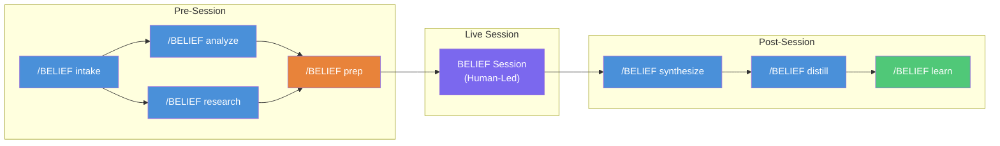
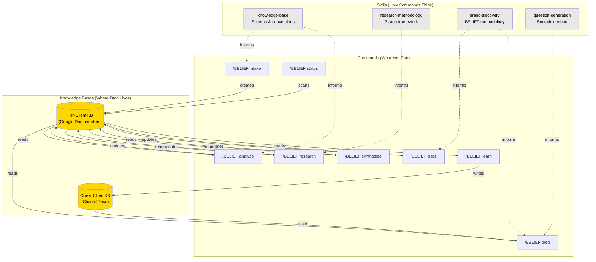
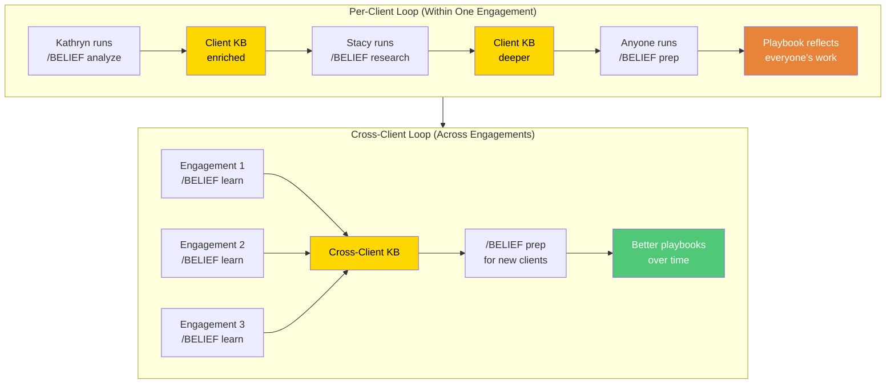
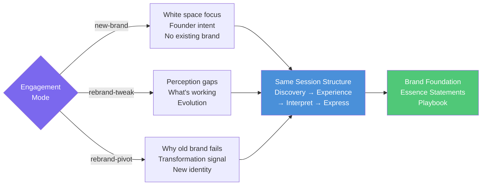

# BELIEF Plugin — System Flow

## End-to-End Workflow

## Knowledge Base Architecture

## Compound Learning Loops

## Three Engagement Modes

## Command Quick Reference

| Command | Sequence | Reads From | Writes To | Key Skill |
|---|---|---|---|---|
| `/BELIEF intake` | 1. Setup | — | Client KB (creates) | knowledge-base |
| `/BELIEF analyze` | 2. Pre-session | Client KB, Drive folder | Client KB | knowledge-base |
| `/BELIEF research` | 2. Pre-session | Client KB, Web | Client KB | research-methodology |
| `/BELIEF prep` | 3. Pre-session | Client KB, Cross-Client KB | Playbook (new doc) | question-generation, brand-discovery |
| `/BELIEF synthesize` | 4. Post-session | Client KB, Session notes | Client KB | brand-discovery |
| `/BELIEF distill` | 5. Post-session | Client KB (full) | Client KB, Foundation doc | brand-discovery |
| `/BELIEF status` | Anytime | All Client KBs | Console output | knowledge-base |
| `/BELIEF learn` | 6. Close-out | Client KB (full) | Cross-Client KB | brand-discovery |
